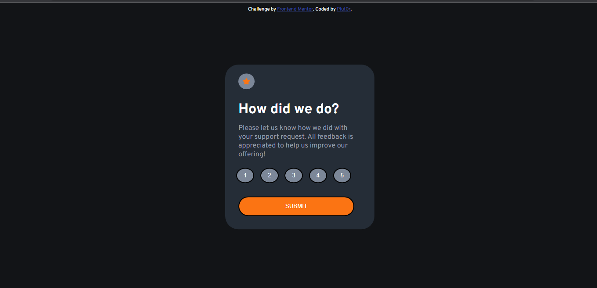
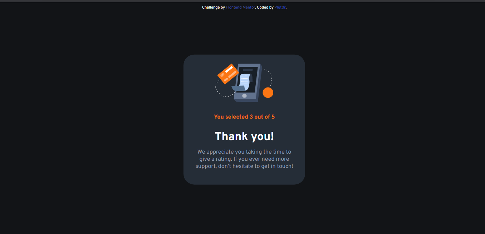
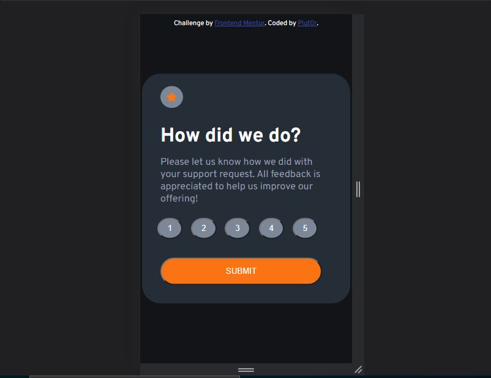
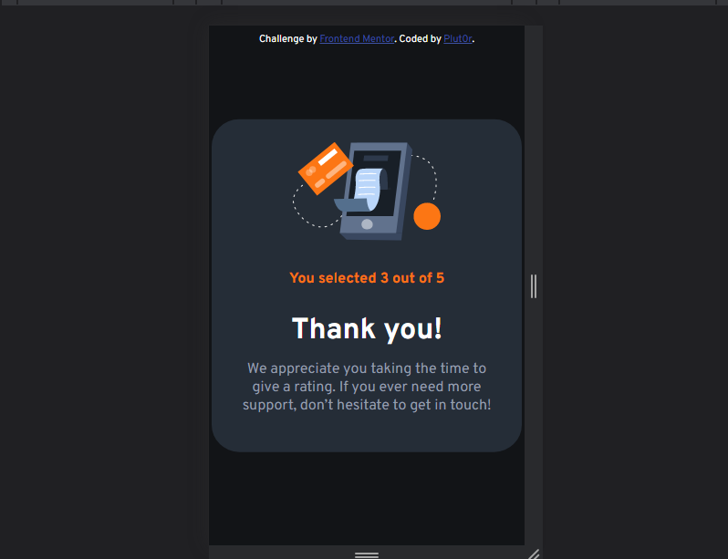

# Frontend Mentor - Interactive rating component solution

This is a solution to the [Interactive rating component challenge on Frontend Mentor](https://www.frontendmentor.io/challenges/interactive-rating-component-koxpeBUmI). Frontend Mentor challenges help you improve your coding skills by building realistic projects. 

## Table of contents

- [Overview](#overview)
  - [The challenge](#the-challenge)
  - [Screenshot](#screenshot)
  - [Links](#links)
  - [Built with](#built-with)
  - [What I learned](#what-i-learned)
  - [Continued development](#continued-development)
  - [Useful resources](#useful-resources)
- [Author](#author)
- [Acknowledgments](#acknowledgments)

## Overview

This website is created as part of Frontend Mentor challenges. It is not completely responsive. The min-width is 346px.

### The challenge

Users should be able to:

- View the optimal layout for the app depending on their device's screen size
- See hover states for all interactive elements on the page
- Select and submit a number rating
- See the "Thank you" card state after submitting a rating

### Screenshot

### Links

- Solution URL: [Github repo url](https://github.com/Plut0r/rating-card.github.io)
- Live Site URL: [Netlify live url](https://rating-card-plut0r.netlify.app/)

### Built with

- Semantic HTML5 markup
- CSS custom properties
- Flexbox
- Javascript

### What I learned

I became more conversant with Javascript and since this will be my first project on front mentor. I believe I can improve and create a better app.

### Continued development

I will be focusing on making any other projects I will be building more responsive and be dealing with javascript more.

### Useful resources

- [MDN](https://developer.mozilla.org/en-US/) - This helped me with refreshing my knowledge on some properties I forgot about. 

## Author

- Frontend Mentor - [@Plut0r](https://www.frontendmentor.io/profile/Plut0r)
- Linkedin - [@Plutor](https://www.linkedin.com/in/plut0r)

## Acknowledgments

Youtube videos and google also helped me.
